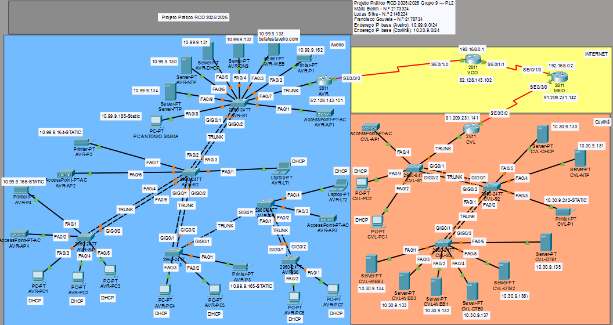

Computer Networks and Data Communication

</div>

---

## 📋 Table of Contents

- [About the Project](#-about-the-project)
- [Network Topology](#-network-topology)
- [Phase 1 — IP Planning (VLSM)](#-phase-1--ip-planning-vlsm)
  - [Aveiro — Subnets](#aveiro--subnets-1099900024)
  - [Aveiro — IP Addressing Table](#aveiro--ip-addressing-table)
  - [Covilhã — Subnets](#covilhã--subnets-103090024)
  - [Covilhã — IP Addressing Table](#covilhã--ip-addressing-table)
- [Phase 2 — Network Configuration](#-phase-2--network-configuration)
  - [Basic Device Configuration](#51-basic-device-configuration)
  - [Router Interfaces (Router-on-a-Stick)](#52-router-interface-configuration)
  - [DHCP Server](#53-dhcp-server-configuration)
  - [DNS and HTTP](#54-dns-and-http-configuration)
  - [VLANs and Trunk](#55-vlan-and-trunk-configuration)
  - [Link Aggregation (LACP)](#56-link-aggregation-lacp)
  - [Routing — RIP V2](#57-routing--rip-v2)
  - [NAT Overload](#58-nat-overload)
  - [Extras](#-extras)
- [Testing and Validation](#-testing-and-validation)
- [Conclusion](#-conclusion)
- [Team](#-team)

---

## 📖 About the Project

This project simulates a **distributed network across two geographic locations** — **Aveiro** and **Covilhã** — interconnected via the Internet through ISP routers (VOD and MEO).

The project was developed in two phases:

**Phase 1 — IP Planning:** IP address dimensioning and planning using **VLSM (Variable Length Subnet Masking)**, a technique that allows variable-size subnets to be created, minimising address waste. The physical topology was also built in Cisco Packet Tracer.

**Phase 2 — Network Configuration:** Full infrastructure implementation, including security configurations, VLANs, DHCP, DNS/HTTP, link aggregation (LACP), dynamic routing (RIPv2), and Internet access via NAT Overload.

### 🔑 Technical Highlights

| Component | Detail |
|---|---|
| Addressing | VLSM with 6 subnets per location |
| Segmentation | VLANs with 802.1Q trunk links |
| Inter-VLAN Routing | Router-on-a-Stick (AVR and CVL) |
| Dynamic Routing | RIP v2 with default route propagation |
| L2 Redundancy | Link Aggregation via LACP (EtherChannel) |
| Internet Access | NAT Overload (PAT) |
| Security | SSH v2, encrypted passwords, brute-force lockout, STP |
| Services | DHCP, DNS, HTTP, NTP, FTP |
| ISP Connectivity | Aveiro → VOD \| Covilhã → MEO |
| Simulation | Cisco Packet Tracer |

---

## 🗺️ Network Topology

> **Replace with the Packet Tracer topology image:**



The topology includes:
- **Aveiro:** Router AVR (2811) → Distribution switch AVR-S1 → Access switches AVR-S2 to AVR-S5
- **Covilhã:** Router CVL (2811) → Access switches CVL-S1 to CVL-S3
- **WAN Link:** AVR ↔ VOD ↔ Internet ↔ MEO ↔ CVL (Serial DCE/DTE cables)

---

## 📐 Phase 1 — IP Planning (VLSM)

VLSM allows a single address block to be subdivided into subnets of different sizes, sorted from largest to smallest and allocated sequentially without overlap. For each subnet, the smallest power of 2 such that `2ⁿ − 2 ≥ required_hosts` is found, giving prefix `/32 − n`. The 1st host of each subnet is reserved as the gateway.

---

### Aveiro — Subnets (`10.99.9.0/24`)

| Subnet | VLAN | Req. Hosts | Block | Prefix | Network Address | Gateway | Last Host | Broadcast |
|--------|------|-----------|-------|--------|----------------|---------|-----------|-----------|
| Kiosk | 70 | 38 | 2⁶=64 | /26 | 10.99.9.0 | 10.99.9.1 | 10.99.9.62 | 10.99.9.63 |
| Guest | 30 | 28 | 2⁵=32 | /27 | 10.99.9.64 | 10.99.9.65 | 10.99.9.94 | 10.99.9.95 |
| IoT | 503 | 24 | 2⁵=32 | /27 | 10.99.9.96 | 10.99.9.97 | 10.99.9.126 | 10.99.9.127 |
| Servers | 160 | 15 | 2⁵=32 | /27 | 10.99.9.128 | 10.99.9.129 | 10.99.9.158 | 10.99.9.159 |
| Printers | 16 | 7 | 2⁴=16 | /28 | 10.99.9.160 | 10.99.9.161 | 10.99.9.174 | 10.99.9.175 |
| Management | 500 | 7 | 2⁴=16 | /28 | 10.99.9.176 | 10.99.9.177 | 10.99.9.190 | 10.99.9.191 |

> **Aveiro Scalability:** `/24` block with 256 addresses. Used: 192. Expansion reserve: `10.99.9.192/26` (64 free addresses).

<details>
<summary>📊 Growth margins per subnet</summary>

| Subnet | Prefix | Usable | Required | Margin |
|--------|--------|--------|----------|--------|
| Kiosk | /26 | 62 | 38 | +24 hosts |
| Guest | /27 | 30 | 28 | +2 hosts |
| IoT | /27 | 30 | 24 | +6 hosts |
| Servers | /27 | 30 | 15 | +15 hosts |
| Printers | /28 | 14 | 7 | +7 hosts |
| Management | /28 | 14 | 7 | +7 hosts |

</details>

---

### Aveiro — IP Addressing Table

> **ISP Configuration:** Router AVR — `62.128.143.101/30` | Router VOD — `62.128.143.102/30` | Network ID: `62.128.143.100/30`

| Device | Interface | IP Address | Subnet Mask | Default Gateway |
|--------|-----------|-----------|-------------|----------------|
| VOD | Serial 0/2/0 | 62.128.143.102 | 255.255.255.252 | N/A |
| AVR | Serial 0/3/0 | 62.128.143.101 | 255.255.255.252 | N/A |
| AVR | Gig0/0.16 | 10.99.9.161 | 255.255.255.240 | N/A |
| AVR | Gig0/0.30 | 10.99.9.65 | 255.255.255.224 | N/A |
| AVR | Gig0/0.70 | 10.99.9.1 | 255.255.255.192 | N/A |
| AVR | Gig0/0.160 | 10.99.9.129 | 255.255.255.224 | N/A |
| AVR | Gig0/0.500 | 10.99.9.177 | 255.255.255.240 | N/A |
| AVR | Gig0/0.503 | 10.99.9.97 | 255.255.255.224 | N/A |
| AVR-NTP | NIC | 10.99.9.130 | 255.255.255.224 | 10.99.9.129 |
| AVR-DHCP | NIC | 10.99.9.131 | 255.255.255.224 | 10.99.9.129 |
| AVR-DNS | NIC | 10.99.9.132 | 255.255.255.224 | 10.99.9.129 |
| AVR-WEB | NIC | 10.99.9.133 | 255.255.255.224 | 10.99.9.129 |
| AVR-AP1 | NIC | 10.99.9.163 | 255.255.255.240 | 10.99.9.161 |
| AVR-P1 | NIC | 10.99.9.162 | 255.255.255.240 | 10.99.9.161 |
| AVR-PC1 | NIC | 10.99.9.2 | 255.255.255.192 | 10.99.9.1 |
| AVR-PC2 | NIC | 10.99.9.3 | 255.255.255.192 | 10.99.9.1 |

---

### Covilhã — Subnets (`10.30.9.0/24`)

| Subnet | VLAN | Req. Hosts | Block | Prefix | Network Address | Gateway | Last Host | Broadcast |
|--------|------|-----------|-------|--------|----------------|---------|-----------|-----------|
| Guest | 30 | 33 | 2⁶=64 | /26 | 10.30.9.0 | 10.30.9.1 | 10.30.9.62 | 10.30.9.63 |
| Management | 500 | 33 | 2⁶=64 | /26 | 10.30.9.64 | 10.30.9.65 | 10.30.9.126 | 10.30.9.127 |
| Servers | 160 | 31 | 2⁶=64 | /26 | 10.30.9.128 | 10.30.9.129 | 10.30.9.190 | 10.30.9.191 |
| SOC | 100 | 15 | 2⁵=32 | /27 | 10.30.9.192 | 10.30.9.193 | 10.30.9.222 | 10.30.9.223 |
| Security | 502 | 12 | 2⁴=16 | /28 | 10.30.9.224 | 10.30.9.225 | 10.30.9.238 | 10.30.9.239 |
| Printers | 16 | 9 | 2⁴=16 | /28 | 10.30.9.240 | 10.30.9.241 | 10.30.9.254 | 10.30.9.255 |

> **Covilhã Scalability:** `/24` block with 256 addresses. Used: 224. Guest and Management require `/26` since 33 hosts exceed the `/27` limit (30 usable).

<details>
<summary>📊 Growth margins per subnet</summary>

| Subnet | Prefix | Usable | Required | Margin |
|--------|--------|--------|----------|--------|
| Guest | /26 | 62 | 33 | +29 hosts |
| Management | /26 | 62 | 33 | +29 hosts |
| Servers | /26 | 62 | 31 | +31 hosts |
| SOC | /27 | 30 | 15 | +15 hosts |
| Security | /28 | 14 | 12 | +2 hosts |
| Printers | /28 | 14 | 9 | +5 hosts |

</details>

---

### Covilhã — IP Addressing Table

> **ISP Configuration:** Router CVL — `91.209.231.141/30` | Router MEO — `91.209.231.142/30` | Network ID: `91.209.231.140/30`

| Device | Interface | IP Address | Subnet Mask | Default Gateway |
|--------|-----------|-----------|-------------|----------------|
| MEO | Serial 0/2/0 | 91.209.231.142 | 255.255.255.252 | N/A |
| CVL | Serial 0/3/0 | 91.209.231.141 | 255.255.255.252 | N/A |
| CVL | Gig0/0.16 | 10.30.9.241 | 255.255.255.240 | N/A |
| CVL | Gig0/0.30 | 10.30.9.1 | 255.255.255.192 | N/A |
| CVL | Gig0/0.100 | 10.30.9.193 | 255.255.255.224 | N/A |
| CVL | Gig0/0.160 | 10.30.9.129 | 255.255.255.192 | N/A |
| CVL | Gig0/0.500 | 10.30.9.65 | 255.255.255.192 | N/A |
| CVL | Gig0/0.502 | 10.30.9.225 | 255.255.255.240 | N/A |
| CVL-DHCP | NIC | 10.30.9.130 | 255.255.255.192 | 10.30.9.129 |
| CVL-NTP | NIC | 10.30.9.131 | 255.255.255.192 | 10.30.9.129 |
| CVL-WEB1 | NIC | 10.30.9.132 | 255.255.255.192 | 10.30.9.129 |
| CVL-WEB2 | NIC | 10.30.9.133 | 255.255.255.192 | 10.30.9.129 |
| CVL-WEB3 | NIC | 10.30.9.134 | 255.255.255.192 | 10.30.9.129 |
| CVL-DTB1 | NIC | 10.30.9.135 | 255.255.255.192 | 10.30.9.129 |
| CVL-DTB2 | NIC | 10.30.9.136 | 255.255.255.192 | 10.30.9.129 |
| CVL-DTB3 | NIC | 10.30.9.137 | 255.255.255.192 | 10.30.9.129 |
| CVL-P1 | NIC | 10.30.9.242 | 255.255.255.240 | 10.30.9.241 |
| CVL-PC1 | NIC | 10.30.9.2 | 255.255.255.192 | 10.30.9.1 |
| CVL-PC2 | NIC | 10.30.9.3 | 255.255.255.192 | 10.30.9.1 |

---

## ⚙️ Phase 2 — Network Configuration

### 5.1. Basic Device Configuration

All devices (routers and switches) were configured with a baseline security hardening set:

| Item | Configuration | Description |
|------|-------------|-------------|
| d) | `enable secret TungTungSahur67!` | Privileged mode password (MD5 hash) |
| e) | `password TungTungSahur41!` | Physical console password |
| f) | `password TungTungSahur42!` | VTY lines password (SSH/Telnet) |
| i) | `username antonio_adm privilege 15 secret AdminAura123456!` | Administrator user |
| j) | `security passwords min-length 16` | Minimum password policy — 16 characters |
| g) | `login block-for 60 attempts 3 within 30` | Brute-force lockout |
| h) | `crypto key generate rsa` (2048-bit) + `ip ssh version 2` | RSA key generation and SSH v2 |
| k) | `ntp server <NTP_server_IP>` | Clock synchronisation (NTP) |
| m) | `service password-encryption` | Type-7 encryption for all plaintext passwords |
| n) | `shutdown` on unused ports | Inactive port security |
| o) | `write memory` | Save configuration to NVRAM |

> **Password note:** The passwords defined in the project brief did not meet the 16-character minimum enforced by item j). After applying `security passwords min-length 16`, the IOS automatically rejects shorter passwords, making the replacement mandatory.

---

### 5.2. Router Interface Configuration

**Router-on-a-Stick** was used for inter-VLAN routing: a single physical interface (`FastEthernet 0/0`) is divided into multiple logical sub-interfaces — one per VLAN — each configured with `encapsulation dot1Q <vlan_id>` and the respective gateway IP address.

#### Router AVR (Aveiro)

```bash
# WAN Interface
interface Serial 0/3/0
 description Link to ISP VOD
 ip address 62.128.143.101 255.255.255.252
 no shutdown

# LAN Interface (example: VLAN 70 — Kiosk)
interface FastEthernet 0/0
 no shutdown

interface FastEthernet 0/0.70
 description Gateway VLAN 70 - Kiosk
 encapsulation dot1Q 70
 ip address 10.99.9.1 255.255.255.192
```

#### Router CVL (Covilhã)

```bash
# WAN Interface
interface Serial 0/3/0
 description Link to ISP MEO
 ip address 91.209.231.141 255.255.255.252
 no shutdown

# LAN Interface (example: VLAN 30 — Guest)
interface FastEthernet 0/0
 no shutdown

interface FastEthernet 0/0.30
 description Gateway VLAN 30 - Guest
 encapsulation dot1Q 30
 ip address 10.30.9.1 255.255.255.192
```

---

### 5.3. DHCP Server Configuration

Dedicated DHCP servers in each location. Dynamic addressing is enabled only for end-user VLANs; infrastructure devices, servers, and printers retain static IPs.

#### AVR-DHCP (Aveiro)

| Pool | VLAN | Default Gateway | Mask | Capacity |
|------|------|----------------|------|----------|
| GuestPool | 30 | 10.99.9.65 | /27 (255.255.255.224) | 30 devices |
| KioskPool | 70 | 10.99.9.1 | /26 (255.255.255.192) | 62 devices |

#### CVL-DHCP (Covilhã)

| Pool | VLAN | Default Gateway | Mask | Capacity |
|------|------|----------------|------|----------|
| GuestPool | 30 | 10.30.9.1 | /26 (255.255.255.192) | 62 devices |
| SocPool | 100 | 10.30.9.193 | /27 (255.255.255.224) | 30 devices |

---

### 5.4. DNS and HTTP Configuration

Internal web service hosted at **`http://betatest.aveiro.com`**, centralised on dedicated servers in VLAN 160 (Servers) in Aveiro.

| Server | Static IP | Mask | Gateway | Role |
|--------|-----------|------|---------|------|
| AVR-WEB | 10.99.9.133 | /27 | 10.99.9.129 | HTTP/HTTPS server with custom `index.html` |
| AVR-DNS | 10.99.9.132 | /27 | 10.99.9.129 | A Record: `betatest.aveiro.com → 10.99.9.133` |

---

### 5.5. VLAN and Trunk Configuration

VLAN 500 (Management) was deployed on all switches with logical addressing via **SVI (Switch Virtual Interface)**. 802.1Q trunks carry VLANs 16, 30, 70, 160, 500, and 503.

| Location | Management Subnet | Mask | Gateway (Router) | IP Range |
|----------|------------------|------|-----------------|----------|
| Aveiro | 10.99.9.176/28 | 255.255.255.240 | 10.99.9.177 | .178 to .190 |
| Covilhã | 10.30.9.64/26 | 255.255.255.192 | 10.30.9.65 | .66 to .126 |

---

### 5.6. Link Aggregation (LACP)

**EtherChannel with LACP** (IEEE 802.3ad) implemented between switches, bundling multiple physical links into a single logical link for redundancy and increased bandwidth, integrated with Spanning Tree.

```
AVR-S3# show etherchannel summary
Group  Port-channel  Protocol  Ports
------+-------------+---------+-------------------------------------------
4      Po4(SU)       LACP      Fa0/4(P) GigO/1(I) GigO/2(P)
```

---

### 5.7. Routing — RIP V2

Dynamic routing implemented with **RIP version 2** (classless), allowing routers to automatically learn subnets from each site. A **default static route** pointing to the ISP was also configured and propagated across the network via `default-information originate`.

```
AVR# show ip route
Gateway of last resort is 62.128.143.102 to network 0.0.0.0

R    10.30.9.0/26   [120/3] via 62.128.143.102 — Serial0/3/0
C    10.99.9.0/26   is directly connected — FastEthernet0/0.70
S*   0.0.0.0/0      [1/0] via 62.128.143.102
```

---

### 5.8. NAT Overload

**NAT Overload (PAT — Port Address Translation)** configured on both border routers (AVR and CVL). An ACL identifies internal private traffic and maps it to the public IP address of the Serial interface connected to the ISP.

```
AVR# show ip nat statistics
Outside Interfaces: Serial0/3/0
Inside Interfaces:  FastEthernet0/0.16, .30, .70, .160, .500, .503
```

---

## 🎁 Extras

### FTP Server (`AVR-FTP`)
Operational backup server in VLAN 160 (Servers), accessible exclusively from VLAN 500 (Management). Centralises configurations and IOS images of all network devices. Access restricted to user `antonio_adm`.

### Admin Workstation (`PC-ANTONIO-SIGMA`)
Dedicated administrator workstation in VLAN 500 (Management) with static IP `10.99.9.185`. The fixed address guarantees a predictable and immutable entry point for SSH access to all devices, isolated from production traffic.

### Spanning Tree (STP)
```bash
spanning-tree vlan 1-4094 priority 0
```
Prevents loops in topologies with redundant links by blocking alternative paths and automatically re-activating them upon failure.

---

## 🧪 Testing and Validation

| Test | Description | Result |
|------|-------------|--------|
| 1.0 | Ping within the same VLAN and between VLANs in Aveiro | ✅ 0% packet loss |
| 1.1 | LACP — `show etherchannel summary` | ✅ Po3, Po4, Po5 (SU) — LACP active |
| 1.2 | Trunks — `show interfaces trunk` | ✅ VLANs 16, 30, 70, 160, 500, 503 trunking 802.1q |
| 1.3 | Unused ports shut down | ✅ Red indicator in Packet Tracer confirmed |
| 2.0 | DHCP IP assignment | ✅ IP `10.99.9.3`, mask `/26`, GW `10.99.9.1`, DNS `10.99.9.132` |
| 2.1 | RIPv2 routing table | ✅ Covilhã subnets learned via RIP on AVR |
| 2.2 | Traceroute Aveiro → Covilhã | ✅ 5 hops: AVR → VOD → Internet → MEO → CVL |
| 3.0 | NAT Overload — translation table | ✅ Private IPs translated to CVL Serial public IP |
| 4.0 | SSH remote access | ✅ `ssh -l antonio_adm 10.99.9.177` with MOTD banner |
| 4.2 | NTP synchronisation | ✅ Stratum 2, synchronised with `10.99.9.130` |

---

## 📝 Conclusion

The project was successfully completed across both phases:

- **Phase 1:** Correct VLSM planning for Aveiro (`10.99.9.0/24`, 192/256 addresses used) and Covilhã (`10.30.9.0/24`, 224/256 addresses used), with physical topology built in Cisco Packet Tracer.

- **Phase 2:** Full configuration of all devices — routers, switches, and servers — with DHCP, DNS, HTTP, NTP, SSH, VLANs, RIPv2, LACP, and NAT Overload fully operational.

The main challenges encountered were the `ip helper-address` configuration for inter-VLAN DHCP, replacing the Standard ACL with an Extended ACL in NAT (to allow communication between branches), and re-enabling a switch port accidentally shut down during item n). All issues were identified, analysed, and resolved, contributing to a deeper understanding of computer network operation.

---

## 👥 Team

| Name |
|------|
| **Mário Belim** |
| **Lucas Silva** | 
| **Francisco Gouveia** | 

---

<div align="center">

*Computer Networks and Data Communication 2025/2026 · Universidade da Madeira*

</div>
